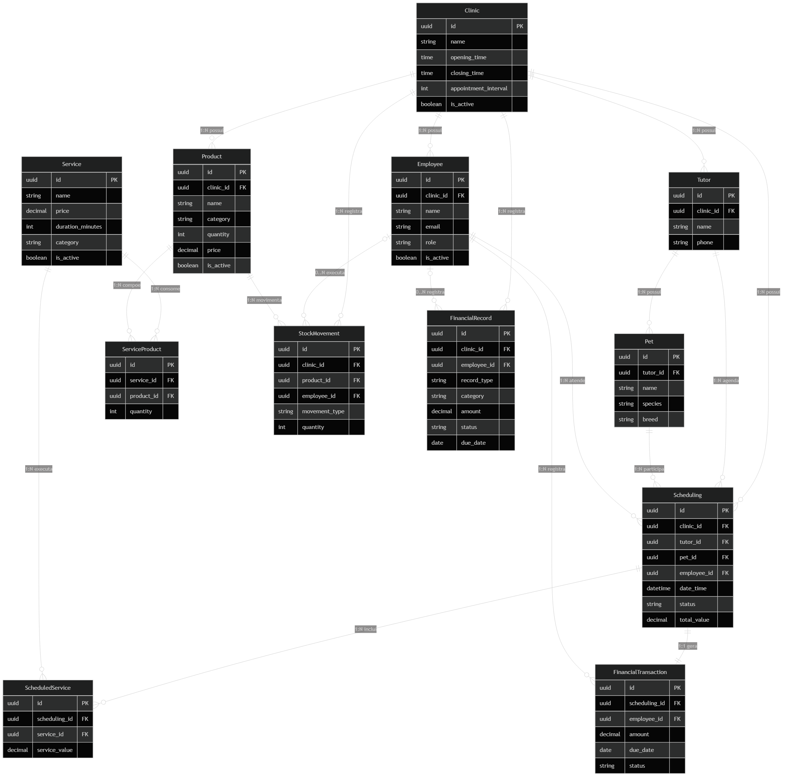
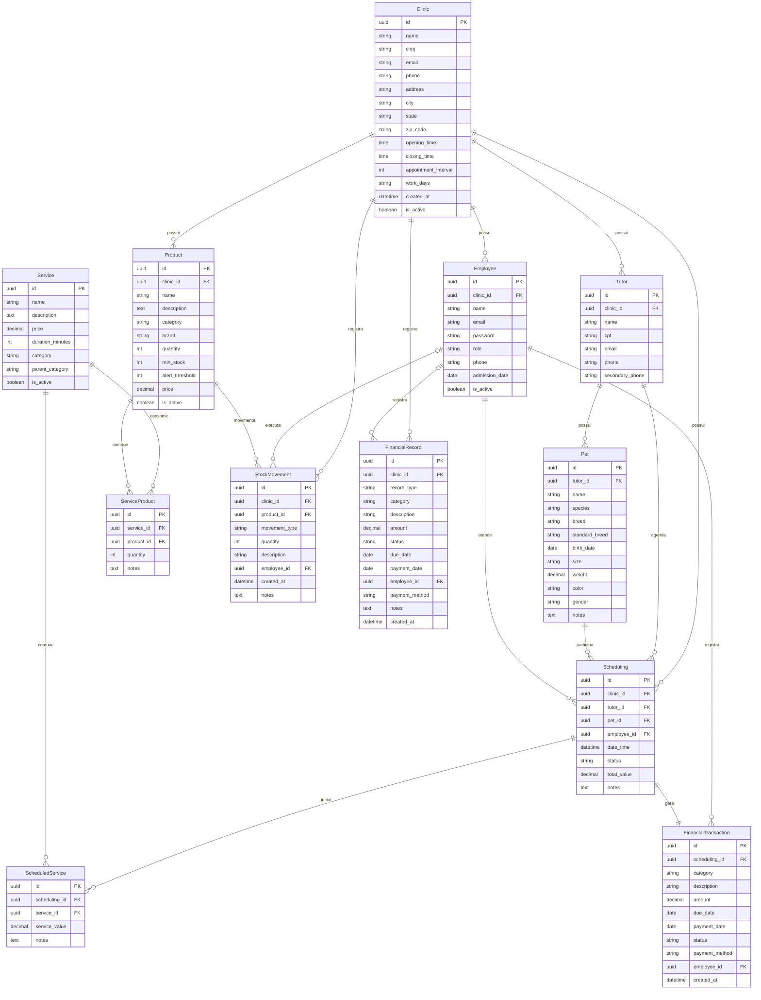

# Esquema do banco de dados

Este documento resume as entidades principais do PetFlow e como elas se relacionam no banco atual.

## Visão geral

- `Clinic` é a entidade central para operação da clínica.
- `Tutor` pertence a uma clínica e pode ter vários `Pet`.
- `Scheduling` conecta clínica, tutor, pet e funcionário.
- `Service` pode consumir produtos via `ServiceProduct`.
- `ScheduledService` registra os serviços executados em um agendamento.
- `FinancialTransaction` representa o financeiro derivado de um agendamento.
- `FinancialRecord` cobre lançamentos financeiros manuais da clínica.
- `StockMovement` registra entradas, saídas e ajustes de estoque.

## Diagrama ER

## Observações

- `FinancialTransaction` está modelado como `OneToOne` com `Scheduling`, mas a regra de negócio documentada diz que o lançamento financeiro do agendamento hoje é manual. O esquema mostra a estrutura do modelo atual.
- `Service` não pertence diretamente a uma clínica no modelo atual.
- `Product`, `Employee`, `Tutor`, `Scheduling`, `StockMovement` e `FinancialRecord` têm vínculo direto com `Clinic`.
- O banco local em desenvolvimento continua sendo o arquivo `db.sqlite3`.
